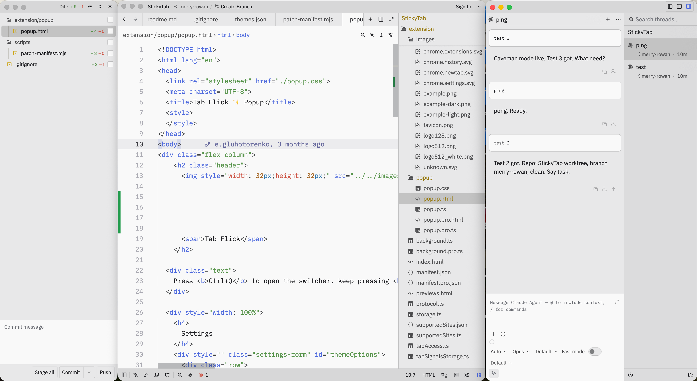
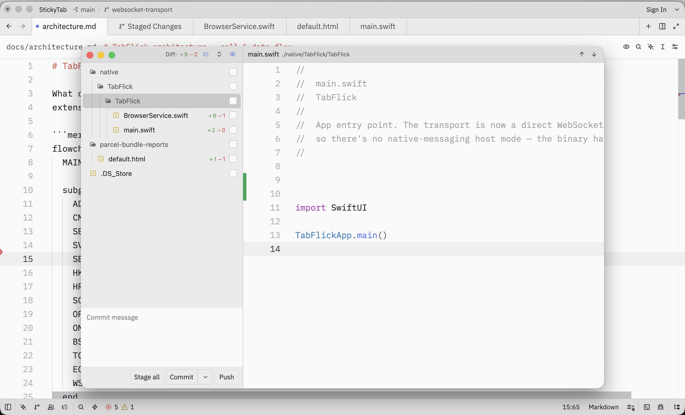

<div align="center">

# Zed Plus

**A fork of [Zed](https://github.com/zed-industries/zed) that pulls its panels out into windows of their own.**

[](https://github.com/zed-industries/zed)
[](./LICENSE-GPL)


</div>

> [!WARNING]
> **Every line here was written by Claude.** I directed the work and reviewed it, but only
> superficially — I don't write Rust, and I don't know Zed's internals well enough to catch a
> subtle mistake in them.
>
> Treat this as a personal build, not a maintained project. It works for what I use it for.
> Nothing guarantees it works for anything else: there are no tests beyond what upstream already
> had, and the changes to Zed's own crates have only been checked by someone unqualified to
> check them.

## Why

Zed keeps a lot of what you need in docked panels, but a dock shows one of them at a time.
Wanting the git panel and the agent side by side means swapping between them all day, on a screen
that usually has room for both.

This fork moves those two into real windows:

- **Beside the editor**, both visible at once
- **On a second display**, out of the way of the code
- **Over the editor**, opened and dismissed like a dialog

The window is another way to reach the same panel, not a copy of it — same conversation, same
staged files, same state.

## Agent window

<kbd>cmd</kbd>+<kbd>alt</kbd>+<kbd>u</kbd>

The conversation and the threads list together, beside the editor rather than squeezed into a
dock next to it. Activating a thread from another worktree switches the editor to it, and this
window with it.

<picture>
  <source media="(prefers-color-scheme: dark)" srcset="docs/screenshots/overview-dark.png">
  
</picture>

## Git window

<kbd>cmd</kbd>+<kbd>alt</kbd>+<kbd>v</kbd>

The diff shows the selected file on its own, rather than Zed's single scroll through every
changed file at once. Click a file to preview it here; double-click to open it as a normal tab —
without an "all changes" tab sitting in your editor for the rest of the day.

<picture>
  <source media="(prefers-color-scheme: dark)" srcset="docs/screenshots/git-window-dark.png">
  
</picture>

## Building

There are no prebuilt releases — build it the way you would build Zed:

```sh
git clone https://github.com/gevgeny/zed-with-idea.git
cd zed-with-idea
cargo run
```

See upstream's [development docs](./docs/src/development) for platform prerequisites.

---

<div align="center">

Everything not described above is upstream Zed, unchanged —
including [licensing](./LICENSE-GPL) and how the editor itself works.

</div>
